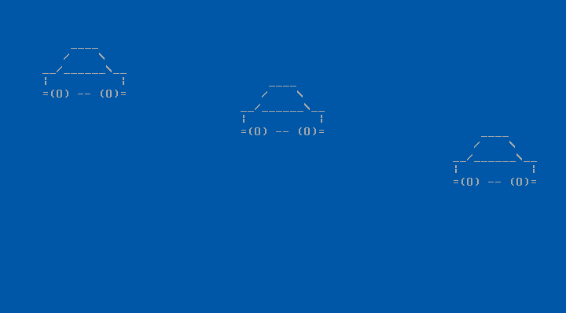

# MBRace

## Overview
MBRace (Master Boot Race) is a minimalist boot sector game written in x86 assembly for the NASM assembler. The objective is to evade oncoming traffic.


## Features
- Simple game
- Size of 487 Bytes
- Uses BIOS interrupts for input
- Writes to VGA memory for output

## Prerequisites
To assemble and run the game, you need the following tools:
- **NASM**: The Netwide Assembler to compile the x86 assembly code.
- **QEMU**: A virtual machine emulator to run the bootable binary.

## Installing Prerequisites
- **NASM**:
  - On Ubuntu/Debian: `sudo apt-get install nasm`
- **QEMU**:
  - On Ubuntu/Debian: `sudo apt-get install qemu-system-x86`

## Setup
1. Clone the repository:
   ```bash
   git clone https://github.com/khde/MBRace.git
   cd MBRace
   ```
2. Assemble the game using the Makefile:
   ```bash
   make
   ```
3. Run the game using QEMU:
   ```bash
   make run
   ```

## Usage
- **Controls**: Use the **Up** and **Down** arrow keys to move and avoid oncoming traffic.
- **Objective**: Survive as long as possible.
